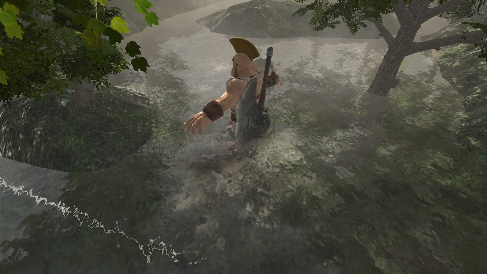

# Foggy Forest!

   
  
   
   

    You are a Barbarian lost in the Foggy Forest!!!
    Will you be able to get out of this foggy wasteland or be stuck here for eternity?

    Let's find out!

# Demo

YouTube URL - [https://youtu.be/lYNYlB1hgU8](https://youtu.be/lYNYlB1hgU8)

# Quickstart

- Download [Unity](https://unity3d.com/get-unity/download/archive) version 2018
  or above.
- Download Microsoft
  [Visual Studio Community](https://visualstudio.microsoft.com/).
- Platform specific SDK such as Android build tools are also required.

## How to Use?

> To build the project you need to go to _Menu>Build Settings>your-os>Build And
> Run_

> Don't forget to change the **Bundle Id** under the _Menu>Build
> Settings>your-os>Player Preferences_

## License

Foggy Forest is licensed under a
[The GNU General Public License v3.0](https://www.gnu.org/licenses/gpl-3.0.en.html).
